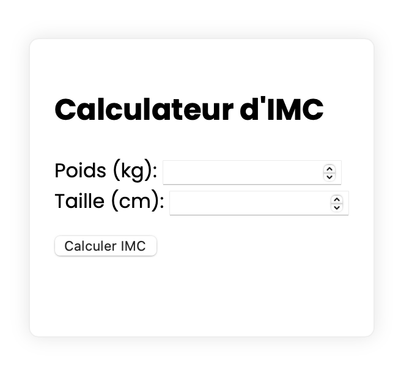

# Calculateur d'IMC 

Une application simple pour calculer l'Indice de Masse Corporelle (IMC) basée sur le poids et la taille d'un individu. L'application fournit également un indicateur visuel pour déterminer la catégorie d'IMC (Maigreur, Normal, Surpoids, Obésité).

## Fonctionnalités 

- Calcul de l'IMC en temps réel.
- Indicateur coloré pour identifier rapidement la catégorie d'IMC.
- Design responsive adapté aux mobiles et aux desktops.

## Comment utiliser

1. Ouvrez `index.html` dans votre navigateur.
2. Entrez votre poids (en kg) et votre taille (en cm).
3. Cliquez sur "Calculer IMC" pour obtenir votre IMC et voir l'indicateur coloré correspondant.

## Personnalisation

- Modifiez le fichier `styles.css` pour adapter le design à vos préférences.

## Contribution

Les contributions sont les bienvenues ! Veuillez créer une issue ou une pull request pour toute contribution ou suggestion.